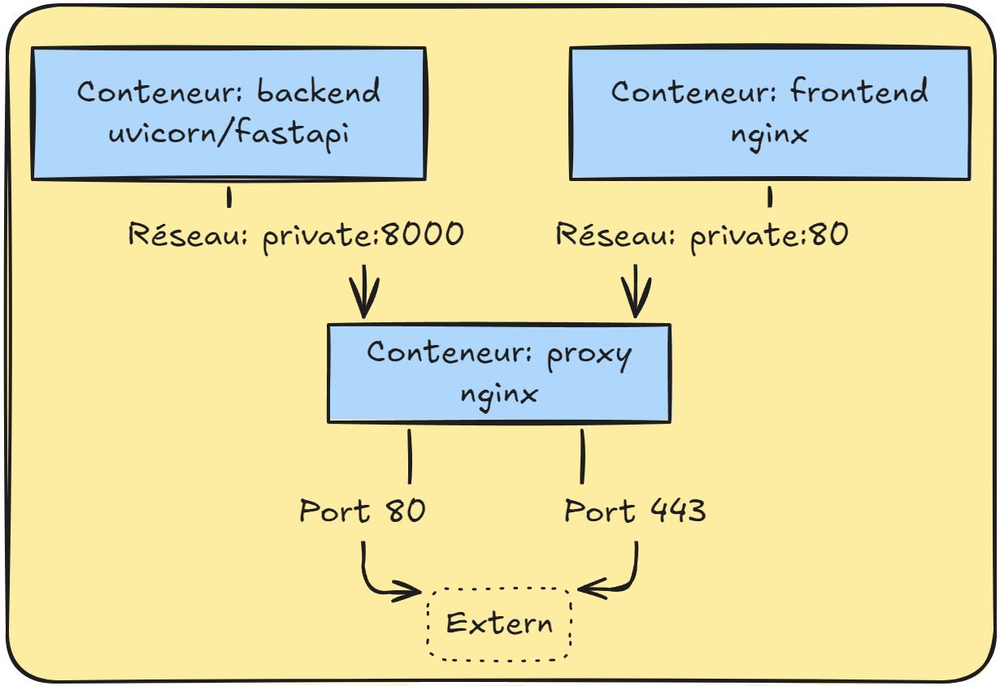

# Basic FastAPI + ReactJS

This is a basic example of a FastAPI backend with a ReactJS frontend.

You can test and deploy in seconds.

## How to run

```bash
docker-compose up --build -d
```

## Mode HTTP, HTTPS or Domain

You can choose between HTTP, HTTPS or Domain.

*Modify the docker-compose*

**Before path:** `build: ./proxy/????`

| mode | path |
| ---- | ---- |
| HTTP | `build: ./proxy/http` |
| HTTPS | `build: ./proxy/https` |
| Domain | `build: ./proxy/domain` |


## Schema




